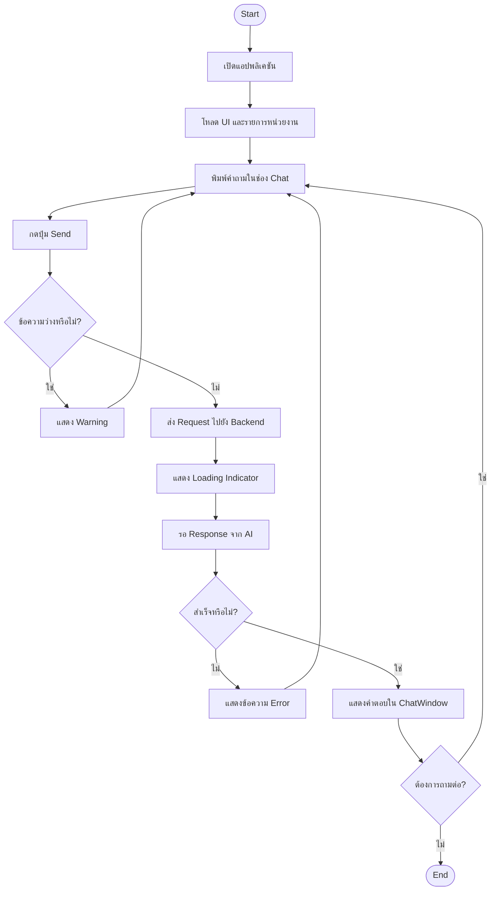
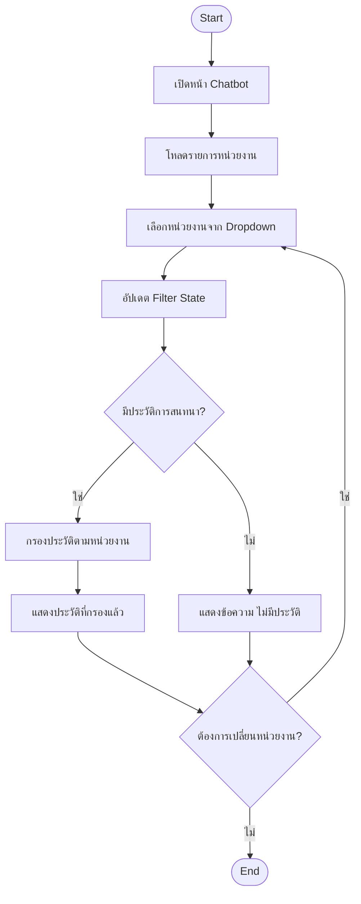
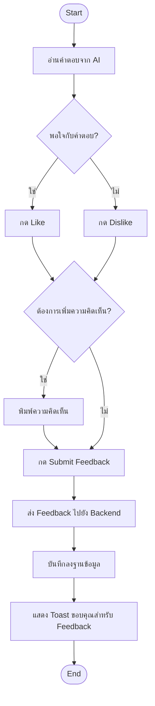
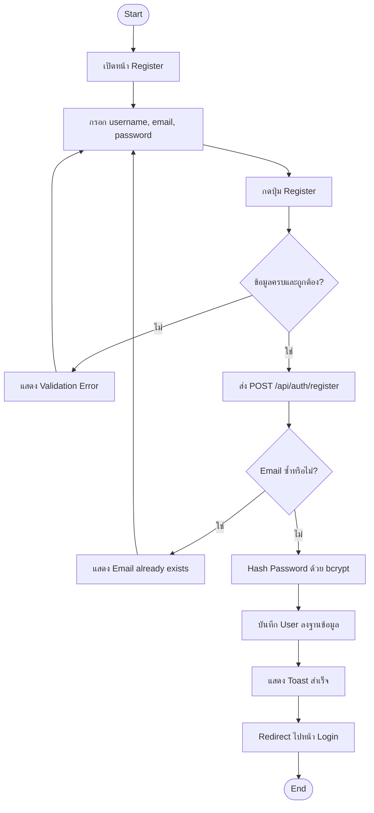
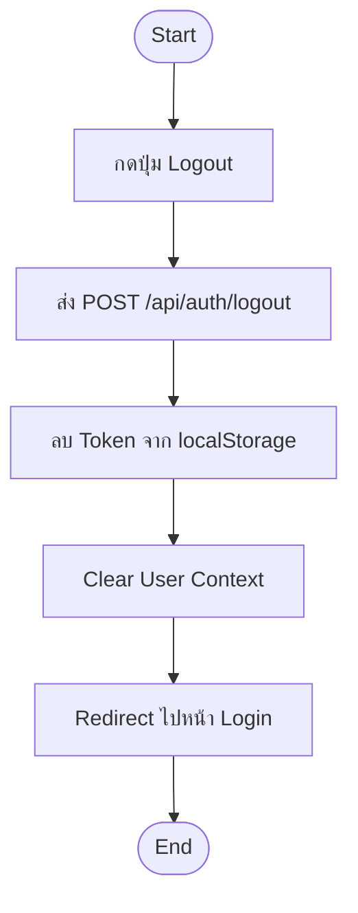
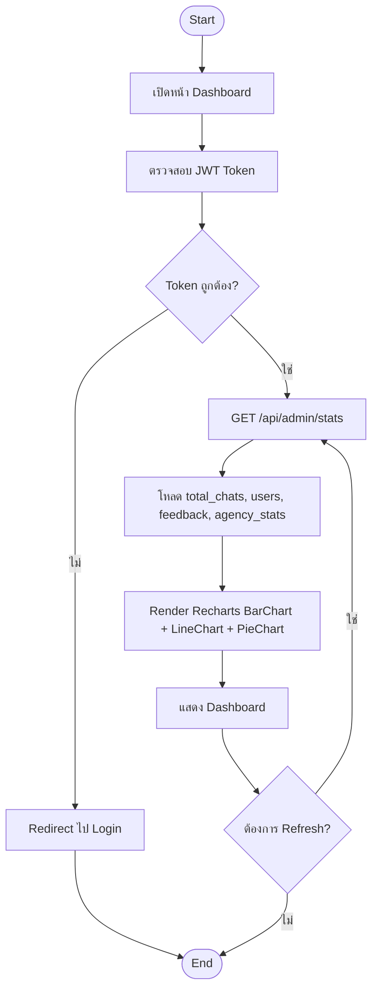
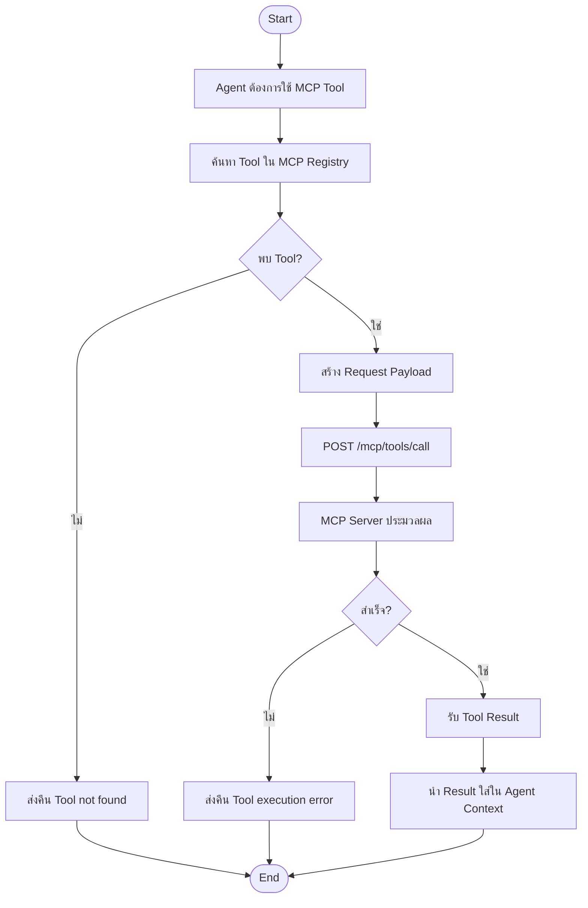

# Activity Diagrams — AI Chatbot Portal

---

## AD-01: การใช้งาน Chatbot (ส่งคำถาม → รับคำตอบ)



---

## AD-02: การเลือกหน่วยงานและกรองข้อมูล



---

## AD-03: การส่ง Feedback



---

## AD-04: การลงทะเบียนผู้ใช้ใหม่



---

## AD-05: การเข้าสู่ระบบและตรวจสอบสิทธิ์

```mermaid
flowchart TD
    Start([Start]) --> OpenLogin[เปิดหน้า Login]
    OpenLogin --> FillCred[กรอก username และ password]
    FillCred --> ClickLogin[กดปุ่ม Login]
    ClickLogin --> SendLogin[ส่ง POST /api/auth/login]
    SendLogin --> FindUser{พบ User ในระบบ?}
    FindUser -->|ไม่| ShowNotFound[แสดง User not found]
    ShowNotFound --> FillCred
    FindUser -->|ใช่| VerifyPass{Password ถูกต้อง?}
    VerifyPass -->|ไม่| ShowWrongPass[แสดง Wrong password]
    ShowWrongPass --> FillCred
    VerifyPass -->|ใช่| GenJWT[สร้าง JWT Token (HS256)]
    GenJWT --> StoreToken[เก็บ Token ใน localStorage]
    StoreToken --> CheckRole{Role = admin?}
    CheckRole -->|ใช่| RedirectAdmin[Redirect ไป /admin/dashboard]
    CheckRole -->|ไม่| RedirectHome[Redirect ไป /]
    RedirectAdmin --> End([End])
    RedirectHome --> End
```

---

## AD-06: การออกจากระบบ



---

## AD-07: การจัดการผู้ใช้ (CRUD)

```mermaid
flowchart TD
    Start([Start]) --> OpenUserMgmt[เปิดหน้า User Management]
    OpenUserMgmt --> LoadUsers[โหลดรายการ User]
    LoadUsers --> ShowTable[แสดงตาราง User]
    ShowTable --> ChooseAction{เลือกการดำเนินการ}

    ChooseAction -->|Create| OpenCreateForm[เปิดฟอร์มสร้าง User]
    OpenCreateForm --> FillUserData[กรอกข้อมูล User]
    FillUserData --> ValidCreate{ข้อมูลถูกต้อง?}
    ValidCreate -->|ไม่| ShowCreateErr[แสดง Error]
    ShowCreateErr --> FillUserData
    ValidCreate -->|ใช่| PostUser[POST /api/admin/users]
    PostUser --> RefreshList[รีเฟรชรายการ]

    ChooseAction -->|Edit| OpenEditForm[เปิดฟอร์มแก้ไข]
    OpenEditForm --> EditData[แก้ไขข้อมูล]
    EditData --> PutUser[PUT /api/admin/users/{id}]
    PutUser --> RefreshList

    ChooseAction -->|Delete| ConfirmDel{ยืนยันการลบ?}
    ConfirmDel -->|ไม่| ShowTable
    ConfirmDel -->|ใช่| DeleteUser[DELETE /api/admin/users/{id}]
    DeleteUser --> RefreshList

    RefreshList --> ShowTable
    ShowTable --> Done{เสร็จสิ้น?}
    Done -->|ไม่| ChooseAction
    Done -->|ใช่| End([End])
```

---

## AD-08: การดู Dashboard และสถิติ



---

## AD-09: การดูและกรองประวัติการสนทนา

```mermaid
flowchart TD
    Start([Start]) --> OpenHistory[เปิดหน้า Conversation History]
    OpenHistory --> LoadConv[GET /api/admin/conversations?page=1]
    LoadConv --> ShowTable[แสดงตารางประวัติ]
    ShowTable --> Filter{ต้องการกรอง?}
    Filter -->|ใช่| SetFilter[ตั้งค่า Filter (agency, date, user)]
    SetFilter --> FetchFiltered[GET /api/admin/conversations?filters]
    FetchFiltered --> ShowTable
    Filter -->|ไม่| ViewDetail{คลิกดู Detail?}
    ViewDetail -->|ใช่| FetchDetail[GET /api/admin/conversations/{id}]
    FetchDetail --> ShowModal[แสดง Modal รายละเอียด]
    ShowModal --> CloseModal[ปิด Modal]
    CloseModal --> ShowTable
    ViewDetail -->|ไม่| Paginate{เปลี่ยนหน้า?}
    Paginate -->|ใช่| LoadConv
    Paginate -->|ไม่| End([End])
```

---

## AD-10: การจัดการ Prompt Template

```mermaid
flowchart TD
    Start([Start]) --> OpenPrompt[เปิดหน้า Prompt Template]
    OpenPrompt --> LoadTemplates[GET /api/admin/prompts]
    LoadTemplates --> ShowList[แสดงรายการ Template]
    ShowList --> SelectTemplate[เลือก Template ที่ต้องการแก้ไข]
    SelectTemplate --> OpenEditor[เปิด Editor พร้อม Template ปัจจุบัน]
    OpenEditor --> EditText[แก้ไข Template Text]
    EditText --> Preview{ต้องการ Preview?}
    Preview -->|ใช่| ShowPreview[แสดงตัวอย่าง Prompt]
    ShowPreview --> EditText
    Preview -->|ไม่| SaveTemplate[PUT /api/admin/prompts/{id}]
    SaveTemplate --> UpdateDB[บันทึกลงฐานข้อมูล]
    UpdateDB --> ShowSuccess[แสดง Toast สำเร็จ]
    ShowSuccess --> EditMore{แก้ไข Template อื่น?}
    EditMore -->|ใช่| ShowList
    EditMore -->|ไม่| End([End])
```

---

## AD-11: การจัดการ MCP Server Connection

```mermaid
flowchart TD
    Start([Start]) --> OpenMCP[เปิดหน้า MCP Management]
    OpenMCP --> LoadConn[GET /api/admin/mcp/connections]
    LoadConn --> ShowConns[แสดงรายการ Connection]
    ShowConns --> Action{เลือกการดำเนินการ}

    Action -->|Test Connection| TestConn[POST /api/admin/mcp/test]
    TestConn --> CheckHealth{MCP Server ตอบสนอง?}
    CheckHealth -->|ใช่| ShowConnected[แสดงสถานะ Connected]
    CheckHealth -->|ไม่| ShowFailed[แสดงสถานะ Failed]
    ShowConnected --> ShowConns
    ShowFailed --> ShowConns

    Action -->|Add Connection| FillConn[กรอก URL และ Config]
    FillConn --> PostConn[POST /api/admin/mcp/connections]
    PostConn --> SaveConn[บันทึก Connection]
    SaveConn --> ShowConns

    Action -->|Delete Connection| ConfirmDel{ยืนยันการลบ?}
    ConfirmDel -->|ใช่| DelConn[DELETE /api/admin/mcp/connections/{id}]
    DelConn --> ShowConns
    ConfirmDel -->|ไม่| ShowConns

    ShowConns --> Done{เสร็จสิ้น?}
    Done -->|ไม่| Action
    Done -->|ใช่| End([End])
```

---

## AD-12: การดูและกรอง Feedback

```mermaid
flowchart TD
    Start([Start]) --> OpenFeedback[เปิดหน้า Feedback]
    OpenFeedback --> LoadFeedback[GET /api/admin/feedback?page=1]
    LoadFeedback --> ShowTable[แสดงตาราง Feedback]
    ShowTable --> Filter{ต้องการกรอง?}
    Filter -->|ใช่| SetFilter[ตั้งค่า Filter (rating, agency, date)]
    SetFilter --> FetchFiltered[GET /api/admin/feedback?filters]
    FetchFiltered --> ShowTable
    Filter -->|ไม่| ViewDetail{คลิกดู Detail?}
    ViewDetail -->|ใช่| ShowDetail[แสดง Conversation ที่เกี่ยวข้อง]
    ShowDetail --> ShowTable
    ViewDetail -->|ไม่| Paginate{เปลี่ยนหน้า?}
    Paginate -->|ใช่| LoadFeedback
    Paginate -->|ไม่| End([End])
```

---

## AD-13: การส่งออกรายงาน

```mermaid
flowchart TD
    Start([Start]) --> OpenExport[เปิดหน้า Export Report]
    OpenExport --> SelectRange[เลือกช่วงวันที่]
    SelectRange --> SelectFormat[เลือกรูปแบบไฟล์ (CSV / Excel)]
    SelectFormat --> SelectScope[เลือกขอบเขตข้อมูล (Conversation / Feedback / Stats)]
    SelectScope --> ClickExport[กดปุ่ม Export]
    ClickExport --> CallAPI[GET /api/admin/export?params]
    CallAPI --> FetchData[ดึงข้อมูลจากฐานข้อมูล]
    FetchData --> GenerateFile[สร้างไฟล์ CSV/Excel]
    GenerateFile --> Download[ส่งไฟล์ให้ Browser Download]
    Download --> End([End])
```

---

## AD-14: กระบวนการ Multi-Agent Routing

```mermaid
flowchart TD
    Start([Start]) --> ReceiveMsg[รับ User Message]
    ReceiveMsg --> KeywordDetect[Keyword Detection Node]
    KeywordDetect --> HasAgency{ตรวจพบหน่วยงาน?}
    HasAgency -->|ไม่| BroadcastAll[ส่งไปทุกหน่วยงาน (Broadcast)]
    HasAgency -->|ใช่| SelectAgents[เลือก Agent ตามหน่วยงาน]
    BroadcastAll --> RunAgents[รัน Agent แบบ Parallel]
    SelectAgents --> RunAgents
    RunAgents --> WaitAll[รอ asyncio.gather() ครบทุก Agent]
    WaitAll --> MergeResults[รวมผลลัพธ์จากทุก Agent]
    MergeResults --> FormatResponse[จัดรูปแบบคำตอบสุดท้าย]
    FormatResponse --> ReturnAnswer[ส่งคำตอบกลับไปยัง API]
    ReturnAnswer --> End([End])
```

---

## AD-15: การตรวจจับหน่วยงานด้วย Keyword Detection

```mermaid
flowchart TD
    Start([Start]) --> LoadKeywords[โหลด Keyword Dictionary]
    LoadKeywords --> NormalizeMsg[Normalize Message (lowercase, strip)]
    NormalizeMsg --> IterAgencies[วนซ้ำทุกหน่วยงาน]
    IterAgencies --> CheckKeyword{พบ Keyword ของหน่วยงานนี้?}
    CheckKeyword -->|ใช่| AddToList[เพิ่มหน่วยงานลง detected_list]
    CheckKeyword -->|ไม่| NextAgency[ไปหน่วยงานถัดไป]
    AddToList --> NextAgency
    NextAgency --> AllDone{ครบทุกหน่วยงาน?}
    AllDone -->|ไม่| IterAgencies
    AllDone -->|ใช่| CheckEmpty{detected_list ว่างเปล่า?}
    CheckEmpty -->|ใช่| SetBroadcast[ตั้งค่าเป็น all agencies]
    CheckEmpty -->|ไม่| ReturnList[ส่งคืน detected_list]
    SetBroadcast --> ReturnList
    ReturnList --> End([End])
```

---

## AD-16: การ Query หน่วยงานแบบ Parallel

```mermaid
flowchart TD
    Start([Start]) --> ReceiveAgents[รับรายการ Agent ที่ต้องรัน]
    ReceiveAgents --> CreateCoroutines[สร้าง Coroutine สำหรับแต่ละ Agent]
    CreateCoroutines --> GatherAll[เรียก asyncio.gather(coroutines)]

    subgraph Parallel Execution
        P1[Agent อย. → LLM Call]
        P2[Agent กรมสรรพากร → LLM Call]
        P3[Agent กรมการปกครอง → LLM Call]
        P4[Agent กรมที่ดิน → LLM Call]
    end

    GatherAll --> P1
    GatherAll --> P2
    GatherAll --> P3
    GatherAll --> P4

    P1 --> CollectResults[รวบรวมผลลัพธ์]
    P2 --> CollectResults
    P3 --> CollectResults
    P4 --> CollectResults

    CollectResults --> FilterFailed{มี Agent ที่ล้มเหลว?}
    FilterFailed -->|ใช่| RemoveFailed[ตัด Result ที่ Error ออก]
    RemoveFailed --> MergeOK[รวม Result ที่สำเร็จ]
    FilterFailed -->|ไม่| MergeOK
    MergeOK --> End([End])
```

---

## AD-17: การเรียกใช้งาน MCP Tool



---

## AD-18: กระบวนการสร้างและบันทึกคำตอบ

```mermaid
flowchart TD
    Start([Start]) --> InsertConv[INSERT conversation (status=processing)]
    InsertConv --> BuildPrompt[สร้าง Prompt จาก system_prompt + history + message]
    BuildPrompt --> CallLLM[POST /v1/chat/completions → OpenThai GPT]
    CallLLM --> LLMSuccess{LLM ตอบสนอง?}
    LLMSuccess -->|ไม่| RetryLLM{Retry < 3?}
    RetryLLM -->|ใช่| CallLLM
    RetryLLM -->|ไม่| SetErrorResp[ตั้งค่า Error Response]
    SetErrorResp --> UpdateConvFail[UPDATE conversation (status=error)]
    UpdateConvFail --> End([End])
    LLMSuccess -->|ใช่| ParseResp[Parse Response Content]
    ParseResp --> ExtractData[Extract answer, agency, confidence]
    ExtractData --> UpdateConv[UPDATE conversation (ai_response, status=done)]
    UpdateConv --> InsertHistory[INSERT conversation_history (role, content)]
    InsertHistory --> ReturnResp[ส่งคำตอบกลับไปยัง Client]
    ReturnResp --> End
```
