# Sequence Diagrams — AI Chatbot Portal

---

## SD-01: การแสดงหน้าแรกและโหลด UI

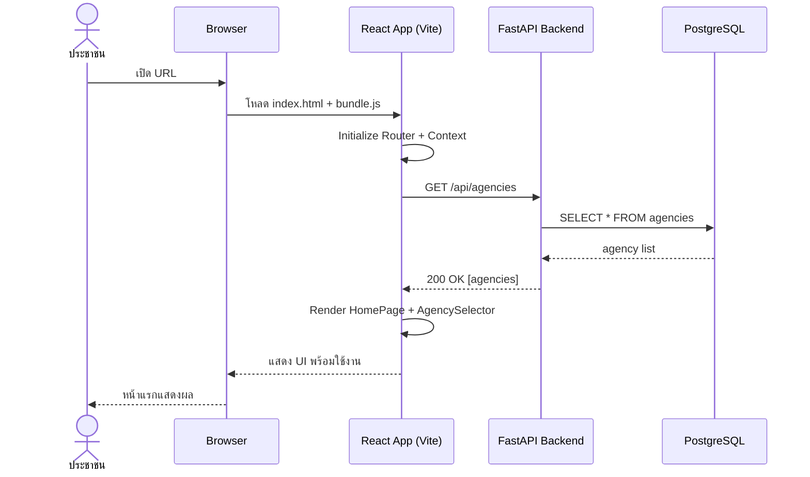
```mermaid
sequenceDiagram
    actor User as ประชาชน
    participant Browser
    participant React as React App (Vite)
    participant API as FastAPI Backend
    participant DB as PostgreSQL

    User->>Browser: เปิด URL
    Browser->>React: โหลด index.html + bundle.js
    React->>React: Initialize Router + Context
    React->>API: GET /api/agencies
    API->>DB: SELECT * FROM agencies
    DB-->>API: agency list
    API-->>React: 200 OK [agencies]
    React->>React: Render HomePage + AgencySelector
    React-->>Browser: แสดง UI พร้อมใช้งาน
    Browser-->>User: หน้าแรกแสดงผล
```

---

## SD-02: การส่งคำถามและรับคำตอบจาก AI Chatbot

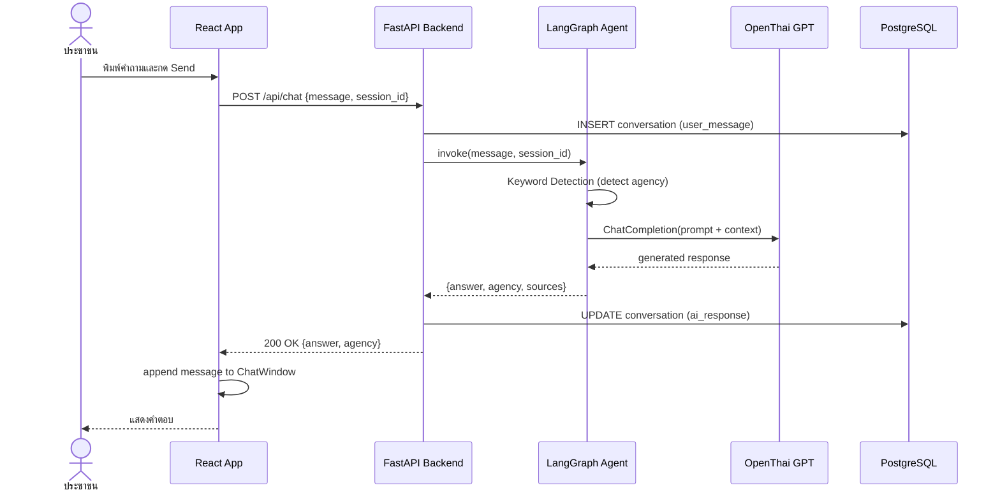
```mermaid
sequenceDiagram
    actor User as ประชาชน
    participant React as React App
    participant API as FastAPI Backend
    participant LG as LangGraph Agent
    participant LLM as OpenThai GPT
    participant DB as PostgreSQL

    User->>React: พิมพ์คำถามและกด Send
    React->>API: POST /api/chat {message, session_id}
    API->>DB: INSERT conversation (user_message)
    API->>LG: invoke(message, session_id)
    LG->>LG: Keyword Detection (detect agency)
    LG->>LLM: ChatCompletion(prompt + context)
    LLM-->>LG: generated response
    LG-->>API: {answer, agency, sources}
    API->>DB: UPDATE conversation (ai_response)
    API-->>React: 200 OK {answer, agency}
    React->>React: append message to ChatWindow
    React-->>User: แสดงคำตอบ
```

---

## SD-03: การเลือกหน่วยงานและกรองผลลัพธ์

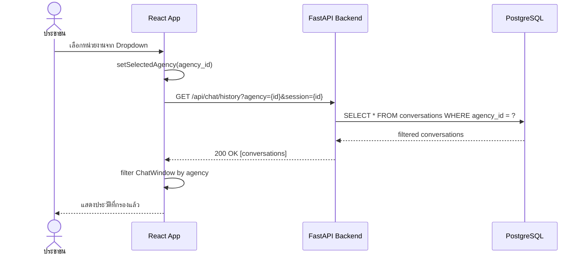
```mermaid
sequenceDiagram
    actor User as ประชาชน
    participant React as React App
    participant API as FastAPI Backend
    participant DB as PostgreSQL

    User->>React: เลือกหน่วยงานจาก Dropdown
    React->>React: setSelectedAgency(agency_id)
    React->>API: GET /api/chat/history?agency={id}&session={id}
    API->>DB: SELECT * FROM conversations WHERE agency_id = ?
    DB-->>API: filtered conversations
    API-->>React: 200 OK [conversations]
    React->>React: filter ChatWindow by agency
    React-->>User: แสดงประวัติที่กรองแล้ว
```

---

## SD-04: การส่ง Feedback จากผู้ใช้

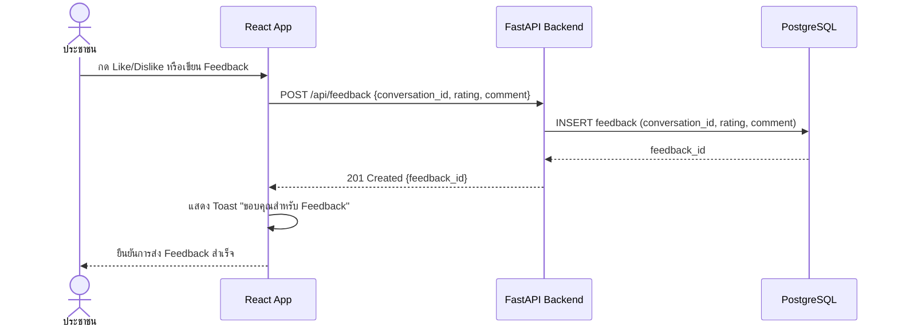
```mermaid
sequenceDiagram
    actor User as ประชาชน
    participant React as React App
    participant API as FastAPI Backend
    participant DB as PostgreSQL

    User->>React: กด Like/Dislike หรือเขียน Feedback
    React->>API: POST /api/feedback {conversation_id, rating, comment}
    API->>DB: INSERT feedback (conversation_id, rating, comment)
    DB-->>API: feedback_id
    API-->>React: 201 Created {feedback_id}
    React->>React: แสดง Toast "ขอบคุณสำหรับ Feedback"
    React-->>User: ยืนยันการส่ง Feedback สำเร็จ
```

---

## SD-05: การลงทะเบียนผู้ใช้ใหม่

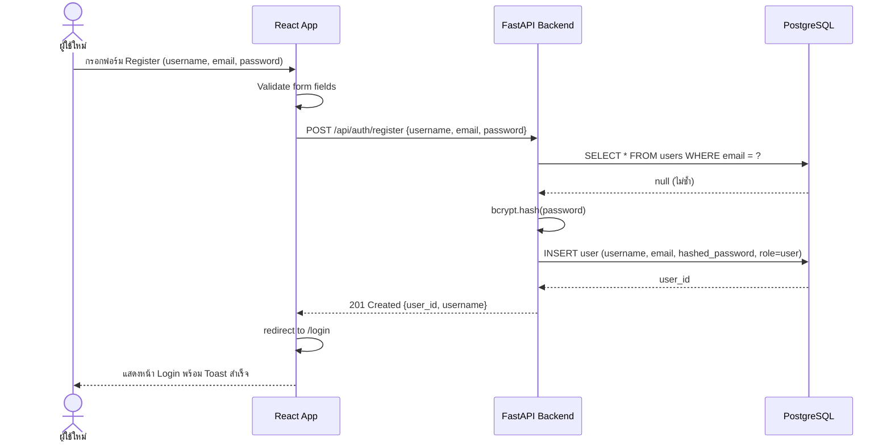
```mermaid
sequenceDiagram
    actor User as ผู้ใช้ใหม่
    participant React as React App
    participant API as FastAPI Backend
    participant DB as PostgreSQL

    User->>React: กรอกฟอร์ม Register (username, email, password)
    React->>React: Validate form fields
    React->>API: POST /api/auth/register {username, email, password}
    API->>DB: SELECT * FROM users WHERE email = ?
    DB-->>API: null (ไม่ซ้ำ)
    API->>API: bcrypt.hash(password)
    API->>DB: INSERT user (username, email, hashed_password, role=user)
    DB-->>API: user_id
    API-->>React: 201 Created {user_id, username}
    React->>React: redirect to /login
    React-->>User: แสดงหน้า Login พร้อม Toast สำเร็จ
```

---

## SD-06: การเข้าสู่ระบบและรับ JWT Token

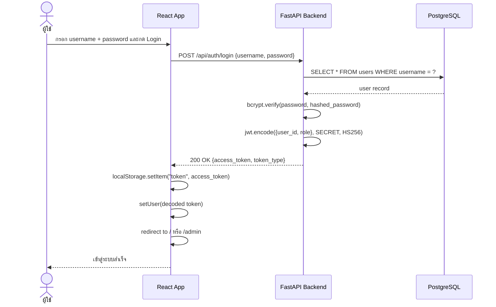
```mermaid
sequenceDiagram
    actor User as ผู้ใช้
    participant React as React App
    participant API as FastAPI Backend
    participant DB as PostgreSQL

    User->>React: กรอก username + password และกด Login
    React->>API: POST /api/auth/login {username, password}
    API->>DB: SELECT * FROM users WHERE username = ?
    DB-->>API: user record
    API->>API: bcrypt.verify(password, hashed_password)
    API->>API: jwt.encode({user_id, role}, SECRET, HS256)
    API-->>React: 200 OK {access_token, token_type}
    React->>React: localStorage.setItem("token", access_token)
    React->>React: setUser(decoded token)
    React->>React: redirect to / หรือ /admin
    React-->>User: เข้าสู่ระบบสำเร็จ
```

---

## SD-07: การออกจากระบบ (Logout)

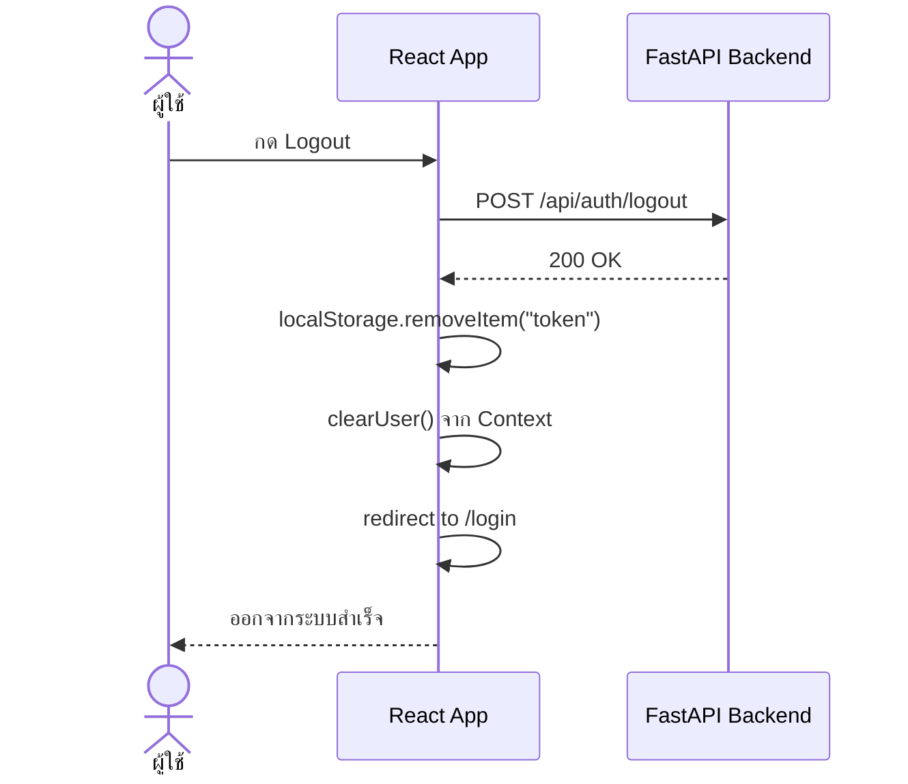
```mermaid
sequenceDiagram
    actor User as ผู้ใช้
    participant React as React App
    participant API as FastAPI Backend

    User->>React: กด Logout
    React->>API: POST /api/auth/logout
    API-->>React: 200 OK
    React->>React: localStorage.removeItem("token")
    React->>React: clearUser() จาก Context
    React->>React: redirect to /login
    React-->>User: ออกจากระบบสำเร็จ
```

---

## SD-08: การเข้าสู่ระบบของเจ้าหน้าที่

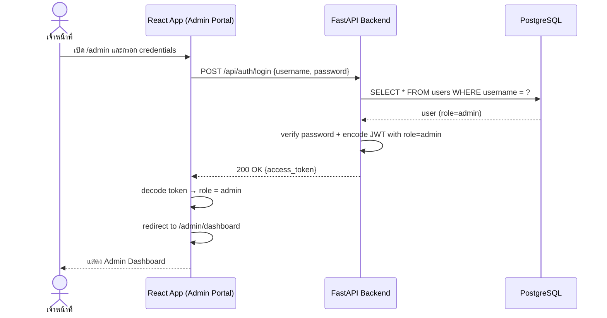
```mermaid
sequenceDiagram
    actor Admin as เจ้าหน้าที่
    participant React as React App (Admin Portal)
    participant API as FastAPI Backend
    participant DB as PostgreSQL

    Admin->>React: เปิด /admin และกรอก credentials
    React->>API: POST /api/auth/login {username, password}
    API->>DB: SELECT * FROM users WHERE username = ?
    DB-->>API: user (role=admin)
    API->>API: verify password + encode JWT with role=admin
    API-->>React: 200 OK {access_token}
    React->>React: decode token → role = admin
    React->>React: redirect to /admin/dashboard
    React-->>Admin: แสดง Admin Dashboard
```

---

## SD-09: การดูภาพรวม Dashboard และสถิติ

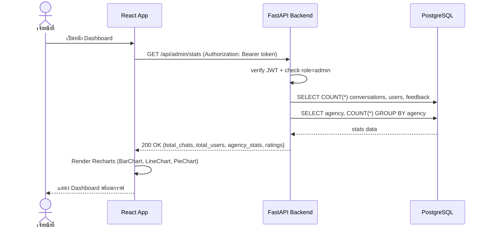
```mermaid
sequenceDiagram
    actor Admin as เจ้าหน้าที่
    participant React as React App
    participant API as FastAPI Backend
    participant DB as PostgreSQL

    Admin->>React: เปิดหน้า Dashboard
    React->>API: GET /api/admin/stats (Authorization: Bearer token)
    API->>API: verify JWT + check role=admin
    API->>DB: SELECT COUNT(*) conversations, users, feedback
    API->>DB: SELECT agency, COUNT(*) GROUP BY agency
    DB-->>API: stats data
    API-->>React: 200 OK {total_chats, total_users, agency_stats, ratings}
    React->>React: Render Recharts (BarChart, LineChart, PieChart)
    React-->>Admin: แสดง Dashboard พร้อมกราฟ
```

---

## SD-10: การจัดการข้อมูลผู้ใช้ (CRUD)

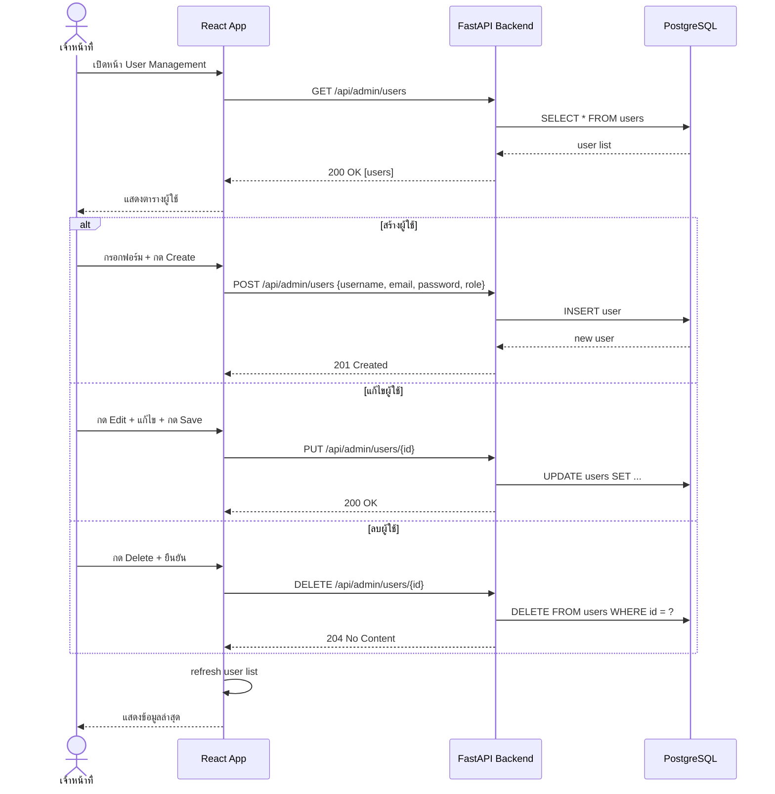
```mermaid
sequenceDiagram
    actor Admin as เจ้าหน้าที่
    participant React as React App
    participant API as FastAPI Backend
    participant DB as PostgreSQL

    Admin->>React: เปิดหน้า User Management
    React->>API: GET /api/admin/users
    API->>DB: SELECT * FROM users
    DB-->>API: user list
    API-->>React: 200 OK [users]
    React-->>Admin: แสดงตารางผู้ใช้

    alt สร้างผู้ใช้
        Admin->>React: กรอกฟอร์ม + กด Create
        React->>API: POST /api/admin/users {username, email, password, role}
        API->>DB: INSERT user
        DB-->>API: new user
        API-->>React: 201 Created
    else แก้ไขผู้ใช้
        Admin->>React: กด Edit + แก้ไข + กด Save
        React->>API: PUT /api/admin/users/{id}
        API->>DB: UPDATE users SET ...
        API-->>React: 200 OK
    else ลบผู้ใช้
        Admin->>React: กด Delete + ยืนยัน
        React->>API: DELETE /api/admin/users/{id}
        API->>DB: DELETE FROM users WHERE id = ?
        API-->>React: 204 No Content
    end

    React->>React: refresh user list
    React-->>Admin: แสดงข้อมูลล่าสุด
```

---

## SD-11: การดูประวัติการสนทนา

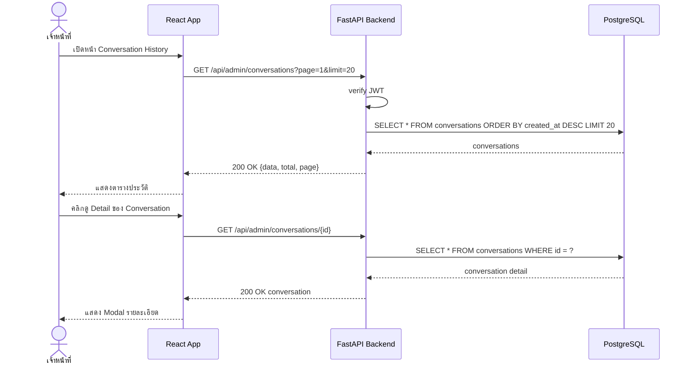
```mermaid
sequenceDiagram
    actor Admin as เจ้าหน้าที่
    participant React as React App
    participant API as FastAPI Backend
    participant DB as PostgreSQL

    Admin->>React: เปิดหน้า Conversation History
    React->>API: GET /api/admin/conversations?page=1&limit=20
    API->>API: verify JWT
    API->>DB: SELECT * FROM conversations ORDER BY created_at DESC LIMIT 20
    DB-->>API: conversations
    API-->>React: 200 OK {data, total, page}
    React-->>Admin: แสดงตารางประวัติ

    Admin->>React: คลิกดู Detail ของ Conversation
    React->>API: GET /api/admin/conversations/{id}
    API->>DB: SELECT * FROM conversations WHERE id = ?
    DB-->>API: conversation detail
    API-->>React: 200 OK conversation
    React-->>Admin: แสดง Modal รายละเอียด
```

---

## SD-12: การจัดการ Prompt Template

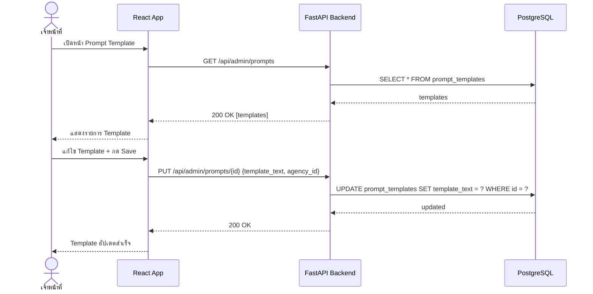
```mermaid
sequenceDiagram
    actor Admin as เจ้าหน้าที่
    participant React as React App
    participant API as FastAPI Backend
    participant DB as PostgreSQL

    Admin->>React: เปิดหน้า Prompt Template
    React->>API: GET /api/admin/prompts
    API->>DB: SELECT * FROM prompt_templates
    DB-->>API: templates
    API-->>React: 200 OK [templates]
    React-->>Admin: แสดงรายการ Template

    Admin->>React: แก้ไข Template + กด Save
    React->>API: PUT /api/admin/prompts/{id} {template_text, agency_id}
    API->>DB: UPDATE prompt_templates SET template_text = ? WHERE id = ?
    DB-->>API: updated
    API-->>React: 200 OK
    React-->>Admin: Template อัปเดตสำเร็จ
```

---

## SD-13: การจัดการการเชื่อมต่อ MCP Server

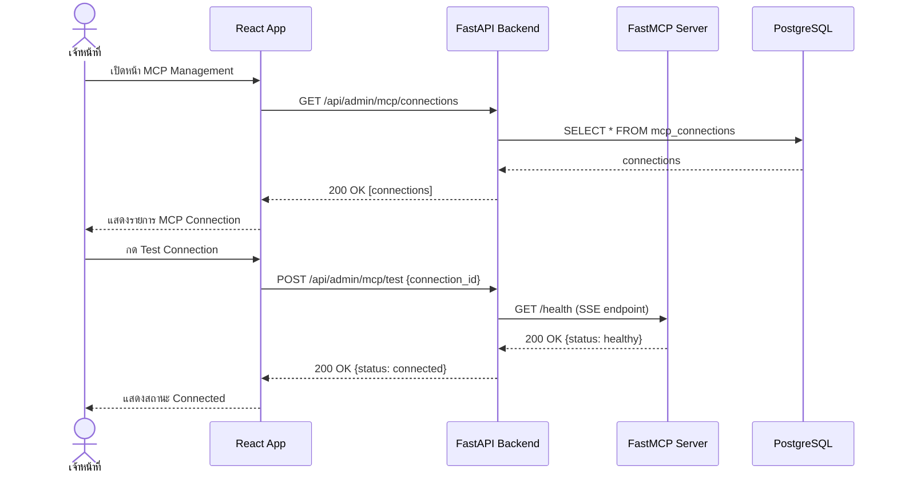
```mermaid
sequenceDiagram
    actor Admin as เจ้าหน้าที่
    participant React as React App
    participant API as FastAPI Backend
    participant MCP as FastMCP Server
    participant DB as PostgreSQL

    Admin->>React: เปิดหน้า MCP Management
    React->>API: GET /api/admin/mcp/connections
    API->>DB: SELECT * FROM mcp_connections
    DB-->>API: connections
    API-->>React: 200 OK [connections]
    React-->>Admin: แสดงรายการ MCP Connection

    Admin->>React: กด Test Connection
    React->>API: POST /api/admin/mcp/test {connection_id}
    API->>MCP: GET /health (SSE endpoint)
    MCP-->>API: 200 OK {status: healthy}
    API-->>React: 200 OK {status: connected}
    React-->>Admin: แสดงสถานะ Connected
```

---

## SD-14: การดูและจัดการ Feedback

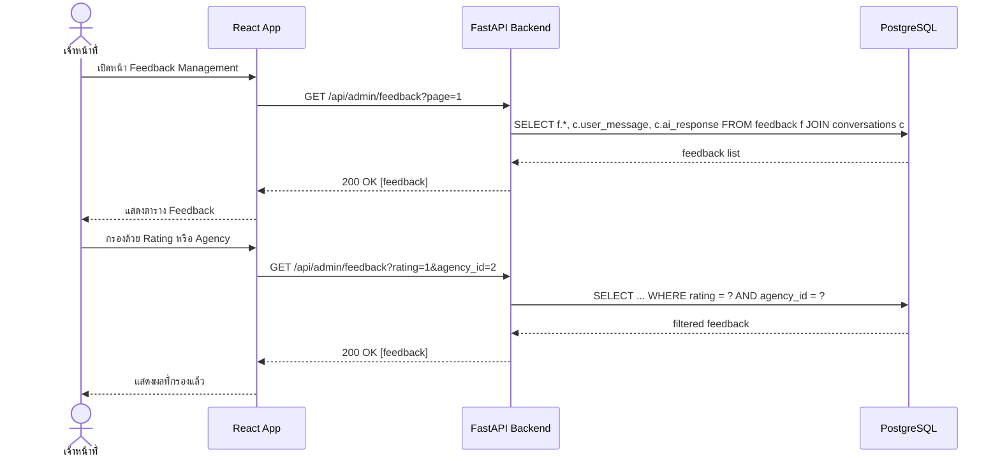
```mermaid
sequenceDiagram
    actor Admin as เจ้าหน้าที่
    participant React as React App
    participant API as FastAPI Backend
    participant DB as PostgreSQL

    Admin->>React: เปิดหน้า Feedback Management
    React->>API: GET /api/admin/feedback?page=1
    API->>DB: SELECT f.*, c.user_message, c.ai_response FROM feedback f JOIN conversations c
    DB-->>API: feedback list
    API-->>React: 200 OK [feedback]
    React-->>Admin: แสดงตาราง Feedback

    Admin->>React: กรองด้วย Rating หรือ Agency
    React->>API: GET /api/admin/feedback?rating=1&agency_id=2
    API->>DB: SELECT ... WHERE rating = ? AND agency_id = ?
    DB-->>API: filtered feedback
    API-->>React: 200 OK [feedback]
    React-->>Admin: แสดงผลที่กรองแล้ว
```

---

## SD-15: การตั้งค่าระบบ

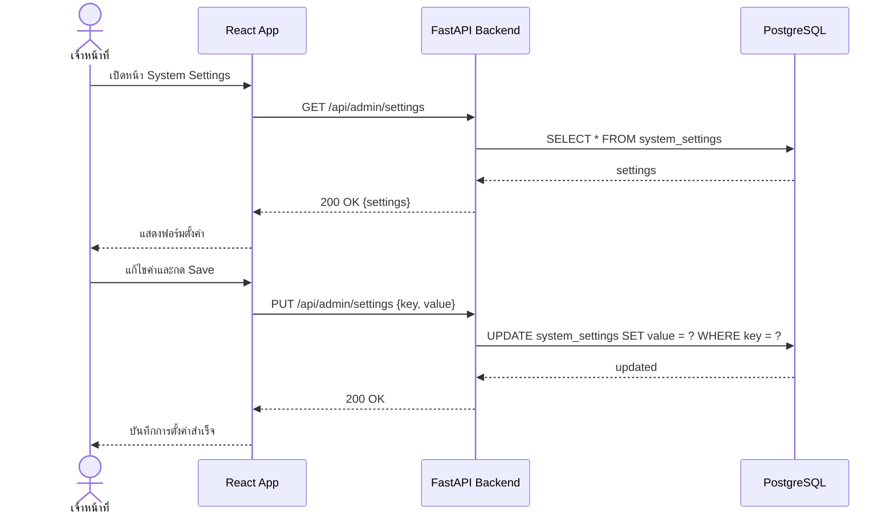
```mermaid
sequenceDiagram
    actor Admin as เจ้าหน้าที่
    participant React as React App
    participant API as FastAPI Backend
    participant DB as PostgreSQL

    Admin->>React: เปิดหน้า System Settings
    React->>API: GET /api/admin/settings
    API->>DB: SELECT * FROM system_settings
    DB-->>API: settings
    API-->>React: 200 OK {settings}
    React-->>Admin: แสดงฟอร์มตั้งค่า

    Admin->>React: แก้ไขค่าและกด Save
    React->>API: PUT /api/admin/settings {key, value}
    API->>DB: UPDATE system_settings SET value = ? WHERE key = ?
    DB-->>API: updated
    API-->>React: 200 OK
    React-->>Admin: บันทึกการตั้งค่าสำเร็จ
```

---

## SD-16: การส่งออกรายงาน

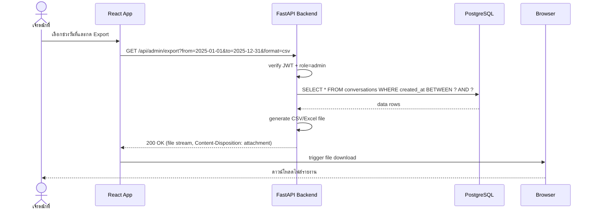
```mermaid
sequenceDiagram
    actor Admin as เจ้าหน้าที่
    participant React as React App
    participant API as FastAPI Backend
    participant DB as PostgreSQL

    Admin->>React: เลือกช่วงวันที่และกด Export
    React->>API: GET /api/admin/export?from=2025-01-01&to=2025-12-31&format=csv
    API->>API: verify JWT + role=admin
    API->>DB: SELECT * FROM conversations WHERE created_at BETWEEN ? AND ?
    DB-->>API: data rows
    API->>API: generate CSV/Excel file
    API-->>React: 200 OK (file stream, Content-Disposition: attachment)
    React->>Browser: trigger file download
    Browser-->>Admin: ดาวน์โหลดไฟล์รายงาน
```

---

## SD-17: กระบวนการ Multi-Agent Routing ด้วย LangGraph

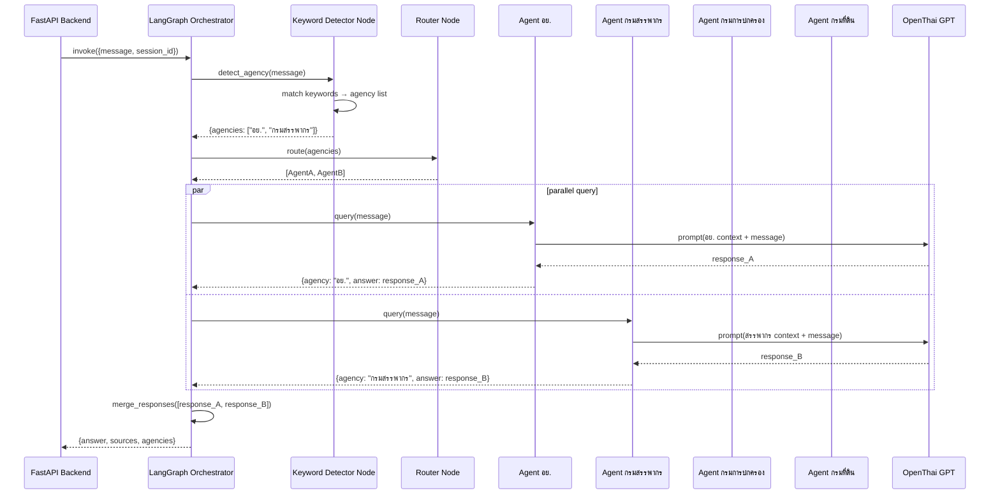
```mermaid
sequenceDiagram
    participant API as FastAPI Backend
    participant LG as LangGraph Orchestrator
    participant KD as Keyword Detector Node
    participant Router as Router Node
    participant AgentA as Agent อย.
    participant AgentB as Agent กรมสรรพากร
    participant AgentC as Agent กรมการปกครอง
    participant AgentD as Agent กรมที่ดิน
    participant LLM as OpenThai GPT

    API->>LG: invoke({message, session_id})
    LG->>KD: detect_agency(message)
    KD->>KD: match keywords → agency list
    KD-->>LG: {agencies: ["อย.", "กรมสรรพากร"]}
    LG->>Router: route(agencies)
    Router-->>LG: [AgentA, AgentB]
    par parallel query
        LG->>AgentA: query(message)
        AgentA->>LLM: prompt(อย. context + message)
        LLM-->>AgentA: response_A
        AgentA-->>LG: {agency: "อย.", answer: response_A}
    and
        LG->>AgentB: query(message)
        AgentB->>LLM: prompt(สรรพากร context + message)
        LLM-->>AgentB: response_B
        AgentB-->>LG: {agency: "กรมสรรพากร", answer: response_B}
    end
    LG->>LG: merge_responses([response_A, response_B])
    LG-->>API: {answer, sources, agencies}
```

---

## SD-18: การตรวจจับหน่วยงานด้วย Keyword Detection

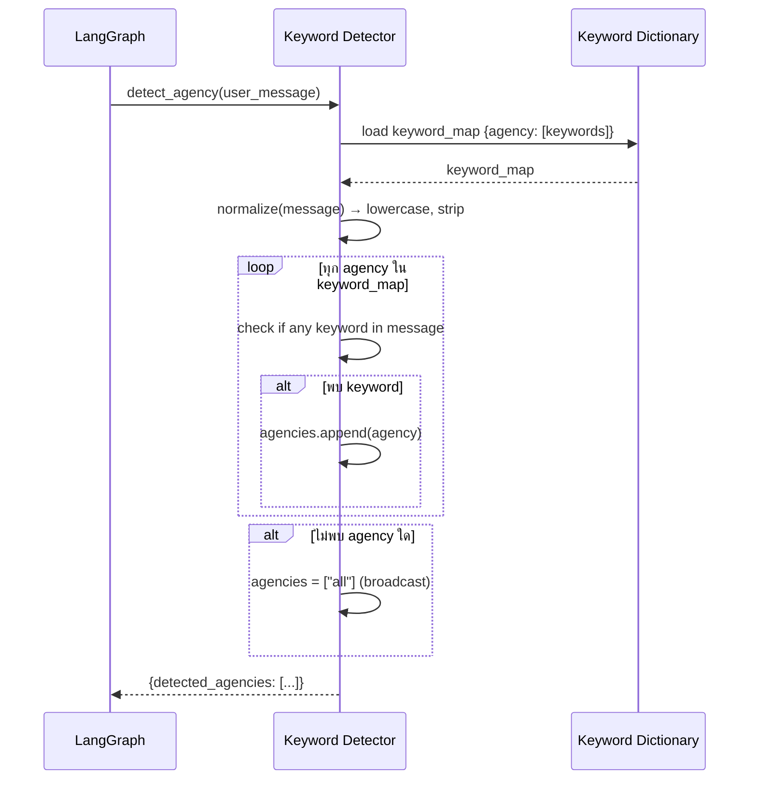
```mermaid
sequenceDiagram
    participant LG as LangGraph
    participant KD as Keyword Detector
    participant KW as Keyword Dictionary

    LG->>KD: detect_agency(user_message)
    KD->>KW: load keyword_map {agency: [keywords]}
    KW-->>KD: keyword_map
    KD->>KD: normalize(message) → lowercase, strip
    loop ทุก agency ใน keyword_map
        KD->>KD: check if any keyword in message
        alt พบ keyword
            KD->>KD: agencies.append(agency)
        end
    end
    alt ไม่พบ agency ใด
        KD->>KD: agencies = ["all"] (broadcast)
    end
    KD-->>LG: {detected_agencies: [...]}
```

---

## SD-19: การ Query ข้อมูลจากหน่วยงานภาครัฐแบบ Parallel

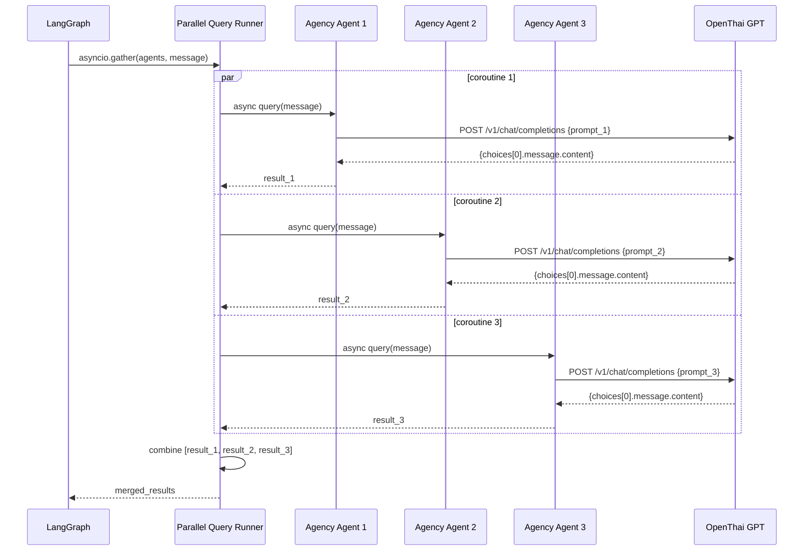
```mermaid
sequenceDiagram
    participant LG as LangGraph
    participant PQ as Parallel Query Runner
    participant A1 as Agency Agent 1
    participant A2 as Agency Agent 2
    participant A3 as Agency Agent 3
    participant LLM as OpenThai GPT

    LG->>PQ: asyncio.gather(agents, message)
    par coroutine 1
        PQ->>A1: async query(message)
        A1->>LLM: POST /v1/chat/completions {prompt_1}
        LLM-->>A1: {choices[0].message.content}
        A1-->>PQ: result_1
    and coroutine 2
        PQ->>A2: async query(message)
        A2->>LLM: POST /v1/chat/completions {prompt_2}
        LLM-->>A2: {choices[0].message.content}
        A2-->>PQ: result_2
    and coroutine 3
        PQ->>A3: async query(message)
        A3->>LLM: POST /v1/chat/completions {prompt_3}
        LLM-->>A3: {choices[0].message.content}
        A3-->>PQ: result_3
    end
    PQ->>PQ: combine [result_1, result_2, result_3]
    PQ-->>LG: merged_results
```

---

## SD-20: การเรียกใช้งาน MCP Tool ผ่าน FastMCP

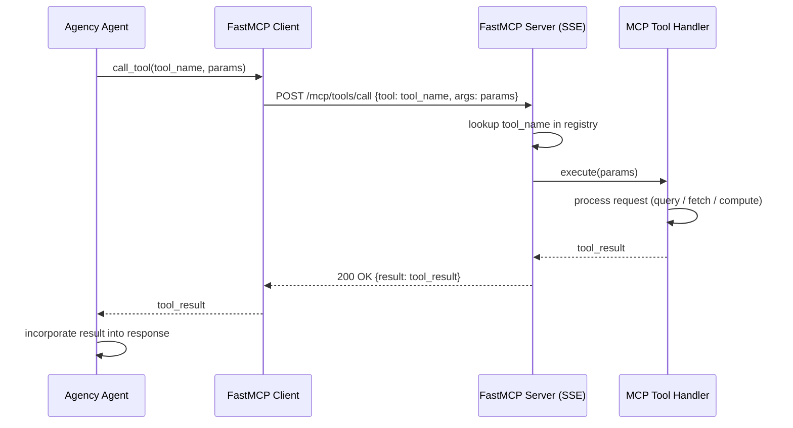
```mermaid
sequenceDiagram
    participant Agent as Agency Agent
    participant MCP as FastMCP Client
    participant Server as FastMCP Server (SSE)
    participant Tool as MCP Tool Handler

    Agent->>MCP: call_tool(tool_name, params)
    MCP->>Server: POST /mcp/tools/call {tool: tool_name, args: params}
    Server->>Server: lookup tool_name in registry
    Server->>Tool: execute(params)
    Tool->>Tool: process request (query / fetch / compute)
    Tool-->>Server: tool_result
    Server-->>MCP: 200 OK {result: tool_result}
    MCP-->>Agent: tool_result
    Agent->>Agent: incorporate result into response
```

---

## SD-21: กระบวนการสร้างคำตอบและบันทึก Conversation History

```mermaid
sequenceDiagram
    participant API as FastAPI Backend
    participant LG as LangGraph
    participant LLM as OpenThai GPT
    participant DB as PostgreSQL

    API->>DB: INSERT conversation (session_id, user_message, status=processing)
    DB-->>API: conversation_id
    API->>LG: invoke({message, conversation_id})
    LG->>LG: build_prompt(system_prompt + history + message)
    LG->>LLM: POST /v1/chat/completions {messages, temperature, max_tokens}
    LLM-->>LG: {choices[0].message.content}
    LG->>LG: parse_response(content)
    LG->>LG: extract {answer, agency, confidence}
    LG-->>API: {answer, agency, sources}
    API->>DB: UPDATE conversation SET ai_response=answer, agency=agency, status=done
    API->>DB: INSERT INTO conversation_history (role, content)
    DB-->>API: updated
    API-->>API: return final response to client
```
