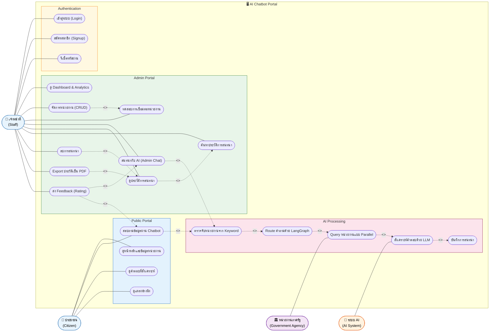

# Use Case Diagram — AI Chatbot Portal

## สรุป Use Case Diagram

Use Case Diagram ของระบบ AI Chatbot Portal แสดงให้เห็นภาพรวมของผู้ใช้งานทั้งหมดและการโต้ตอบกับระบบ โดยระบบถูกออกแบบให้รองรับผู้ใช้งาน 2 กลุ่มหลักและระบบภายนอก 2 ระบบ ได้แก่ ประชาชนทั่วไป เจ้าหน้าที่ภาครัฐ ระบบ AI (LLM) และหน่วยงานภาครัฐที่เชื่อมต่อผ่าน API

**ประชาชน** มีสิทธิ์เข้าถึง Public Portal โดยไม่ต้องเข้าสู่ระบบ สามารถดูข้อมูลหน่วยงาน สอบถามข้อมูลผ่าน Chatbot และรับคำตอบที่สังเคราะห์จากหลายหน่วยงานพร้อมแหล่งอ้างอิง นอกจากนี้ยังสามารถให้ Feedback ต่อคำตอบที่ได้รับในรูปแบบของ Rating ซึ่งเป็น Use Case แบบ <<extend>> ที่เกิดขึ้นได้ในบางเงื่อนไข

**เจ้าหน้าที่** ต้องผ่านการเข้าสู่ระบบก่อน จึงจะสามารถเข้าถึง Admin Portal ที่มีความสามารถครบถ้วนกว่า ได้แก่ การดู Dashboard วิเคราะห์สถิติ การจัดการข้อมูลหน่วยงาน (CRUD) รวมถึงการทดสอบการเชื่อมต่อกับหน่วยงาน การสนทนากับ AI แบบเห็น Agent Steps และการจัดการประวัติการสนทนา ทั้งการค้นหา ลบ และ Export เป็น PDF

**ความสัมพันธ์ <<include>>** ที่สำคัญในระบบคือกระบวนการของ AI ซึ่งทุกครั้งที่มีการสอบถามข้อมูลจะต้องผ่านขั้นตอนที่ต่อเนื่องกันอย่างบังคับ ได้แก่ การตรวจจับหน่วยงานจาก Keyword การ Route คำถามด้วย LangGraph การ Query หน่วยงานแบบ Parallel ด้วย asyncio.gather() การสังเคราะห์คำตอบด้วย LLM และการบันทึกการสนทนาลงฐานข้อมูล ขั้นตอนเหล่านี้เกิดขึ้นทุกครั้งโดยผู้ใช้จะเห็นเป็น Agent Steps บนหน้าจอ

**ความสัมพันธ์ <<extend>>** ได้แก่ การส่ง Feedback ที่เกิดขึ้นหลังจากได้รับคำตอบเท่านั้น การทดสอบการเชื่อมต่อที่เกิดขึ้นระหว่างการจัดการหน่วยงาน รวมถึงการลบและ Export ประวัติที่เป็นทางเลือกเสริมจากการดูประวัติการสนทนา

โดยรวมแล้ว ระบบมี Use Case ทั้งหมด 21 รายการ แบ่งออกเป็น 4 กลุ่มตามขอบเขตการทำงาน คือ Public Portal (4), Authentication (3), Admin Portal (9) และ AI Processing (5) ซึ่งสะท้อนถึงความซับซ้อนของระบบที่ต้องรองรับทั้งผู้ใช้งานทั่วไปและการประมวลผล AI แบบ Multi-Agent ในเวลาเดียวกัน

---

## ภาพรวม Use Case Diagram



---

## อธิบาย Actors

| Actor | บทบาท |
|-------|-------|
| 👤 ประชาชน (Citizen) | ผู้ใช้งานทั่วไปที่เข้าถึง Public Portal โดยไม่ต้อง Login สามารถสอบถามข้อมูลภาครัฐผ่าน Chatbot ได้ทันที |
| 👤 เจ้าหน้าที่ (Staff) | ผู้ใช้งานที่ผ่านการ Login สามารถเข้าถึง Admin Portal เพื่อจัดการระบบ ดู Dashboard และใช้งาน Chat แบบเต็มรูปแบบ |
| 🤖 ระบบ AI (AI System) | External System (OpenThai GPT / LLM) ที่ทำหน้าที่สังเคราะห์คำตอบจากข้อมูลที่ได้จากหน่วยงาน |
| 🏛️ หน่วยงานภาครัฐ | External System (API / MCP / A2A) ของหน่วยงาน เช่น อย., กรมสรรพากร, กรมการปกครอง, กรมที่ดิน |

---

## อธิบาย Use Cases

### Public Portal
| Use Case | คำอธิบาย |
|----------|----------|
| ดูหน้าหลักและข้อมูลหน่วยงาน | แสดง Landing Page พร้อม Agency Cards และคำถามตัวอย่าง |
| สอบถามข้อมูลผ่าน Chatbot | พิมพ์คำถามภาษาไทยแล้วรับคำตอบจาก AI |
| ดูคำตอบที่สังเคราะห์ | แสดงคำตอบที่รวมข้อมูลจากหลายหน่วยงาน พร้อม Agent Steps |
| ดูแหล่งอ้างอิง | แสดง References ลิงก์ไปยังเว็บไซต์หน่วยงาน |

### Authentication
| Use Case | คำอธิบาย |
|----------|----------|
| เข้าสู่ระบบ (Login) | ยืนยันตัวตนด้วย Email + Password → ได้รับ JWT Token |
| สมัครสมาชิก (Signup) | สร้าง Account ใหม่สำหรับเจ้าหน้าที่ |
| รีเซ็ตรหัสผ่าน | ขอ Reset Token ผ่าน Email เพื่อตั้งรหัสผ่านใหม่ |

### Admin Portal
| Use Case | คำอธิบาย |
|----------|----------|
| ดู Dashboard & Analytics | ดูสถิติ: Total Queries, Agency Usage, Feedback Score, Charts |
| จัดการหน่วยงาน (CRUD) | เพิ่ม / แก้ไข / ลบ หน่วยงาน พร้อม Config: Connection Type, Endpoint, Data Scope |
| ทดสอบการเชื่อมต่อ | ทดสอบ Endpoint ของหน่วยงานก่อน Activate <<extend>> จัดการหน่วยงาน |
| สนทนากับ AI (Admin Chat) | Chat แบบ Admin เห็น Agent Steps และ Sources |
| ดูประวัติการสนทนา | แสดงรายการ Conversation ทั้งหมดเรียงตามเวลา |
| ค้นหาประวัติ | กรองประวัติตาม keyword หรือหน่วยงาน <<include>> ดูประวัติ |
| ลบการสนทนา | ลบ Conversation ออกจากระบบ <<extend>> ดูประวัติ |
| Export ประวัติเป็น PDF | ดาวน์โหลดประวัติสนทนาเป็นไฟล์ PDF <<extend>> ดูประวัติ |
| ส่ง Feedback (Rating) | กด 👍/👎 พร้อมเหตุผล <<extend>> สนทนากับ AI / สอบถามข้อมูล |

### AI Processing (Internal)
| Use Case | คำอธิบาย |
|----------|----------|
| ตรวจจับหน่วยงานจาก Keyword | วิเคราะห์ keyword ภาษาไทยในคำถาม → จับคู่กับหน่วยงาน |
| Route คำถามด้วย LangGraph | ใช้ LLM + data_scope ตัดสินใจ route <<include>> ตรวจจับ keyword |
| Query หน่วยงานแบบ Parallel | ส่ง query ไปทุกหน่วยงานพร้อมกันด้วย asyncio.gather() |
| สังเคราะห์คำตอบด้วย LLM | นำข้อมูลจากทุกหน่วยงาน → ส่ง Prompt ไป LLM → ได้คำตอบเดียว |
| บันทึกการสนทนา | บันทึก Conversation + Messages ลง PostgreSQL |

---

## ความสัมพันธ์ Include / Extend

```
<<include>> = Use Case A บังคับเรียก B เสมอ
<<extend>>  = Use Case A อาจเรียก B ในบางเงื่อนไข
```

| Base Use Case | Relationship | Extension/Inclusion |
|---------------|-------------|---------------------|
| สอบถามข้อมูล | <<include>> | ตรวจจับหน่วยงานจาก Keyword |
| ตรวจจับหน่วยงาน | <<include>> | Route คำถามด้วย LangGraph |
| Route คำถาม | <<include>> | Query หน่วยงานแบบ Parallel |
| Query หน่วยงาน | <<include>> | สังเคราะห์คำตอบด้วย LLM |
| สังเคราะห์คำตอบ | <<include>> | บันทึกการสนทนา |
| สนทนากับ AI (Admin) | <<include>> | ตรวจจับหน่วยงานจาก Keyword |
| ดูประวัติ | <<include>> | ค้นหาประวัติ |
| จัดการหน่วยงาน | <<include>> | ทดสอบการเชื่อมต่อ |
| สนทนากับ AI | <<extend>> | ส่ง Feedback |
| สอบถามข้อมูล (Public) | <<extend>> | ส่ง Feedback |
| ดูประวัติ | <<extend>> | ลบการสนทนา |
| ดูประวัติ | <<extend>> | Export ประวัติเป็น PDF |
